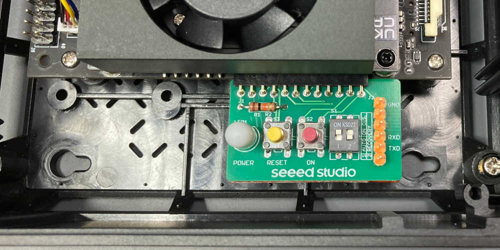

# JBUTTONS

## Features

* Power status display.
* Provide POWER button and RESET button.
* Auto power on enable/disable.
* Force recovery mode.
* Pin header for serial console. ([FTDI TTL-232R-3V3 cable](https://ftdichip.com/products/ttl-232r-3v3/) can be directly connected.)

## Parts

* [PCB](schematic)
* [support block](3d/JBUTTONS_support.stl)
